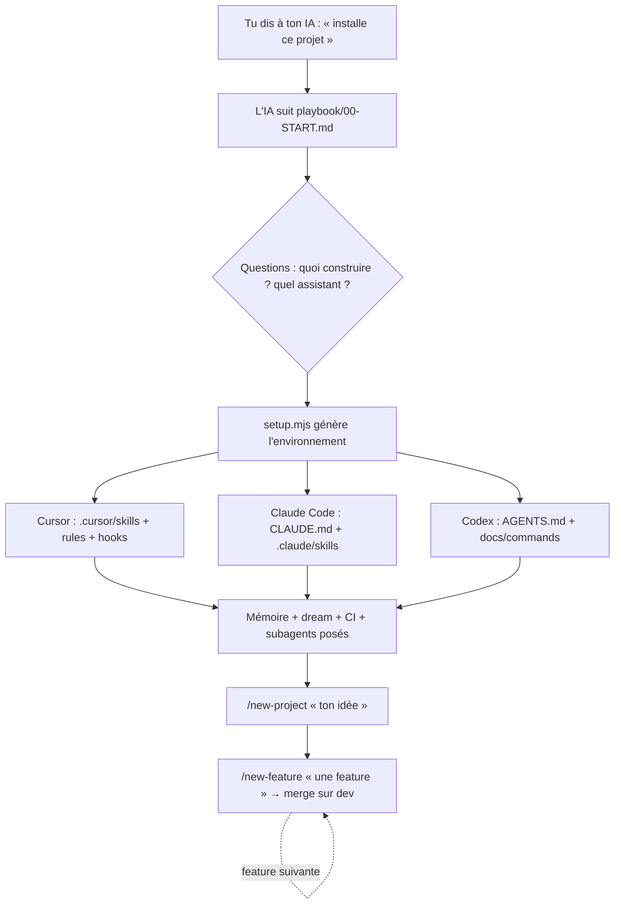

<h1 align="center">🎨 Vibecoding Starter Kit</h1>

<p align="center">
  <strong>Un environnement de dev IA complet, généré en parlant à ton assistant.</strong>
  <br />
  Tu décris ton app, l'IA la construit — encadrée par les bons rails.
</p>

<p align="center">
  <a href="#-démarrage-rapide"><strong>Démarrage rapide »</strong></a>
  ·
  <a href="#-comment-ça-marche">Comment ça marche</a>
  ·
  <a href="https://github.com/ohvignas/vibecoding-starter-kit/issues">Signaler un bug</a>
</p>

<p align="center">
  <a href="https://github.com/ohvignas/vibecoding-starter-kit/actions"></a>
  <a href="LICENSE"></a>
  
  
  <a href="http://makeapullrequest.com"></a>
</p>

---

Ce dépôt fait deux choses : c'est un **kit pour débutants** de la formation **Vibe Coding** (3 stacks expliquées + le contexte à donner à l'IA), **et** un **installeur piloté par l'IA** qui génère un environnement de développement complet — 4 commandes, mémoire persistante, revue de code, CI — pour **Cursor, Claude Code et Codex**.

> [!TIP]
> Pas besoin de choisir un seul assistant : l'installeur configure celui que tu utilises, et le projet reste **portable** (les mêmes règles marchent partout).

<details>
<summary><strong>📑 Table des matières</strong></summary>

- [Pourquoi ce projet](#-pourquoi-ce-projet)
- [Fonctionnalités](#-fonctionnalités)
- [Démarrage rapide](#-démarrage-rapide)
- [Comment ça marche](#-comment-ça-marche)
- [Les 4 commandes](#-les-4-commandes)
- [Les 3 stacks](#-les-3-stacks)
- [Ce qui est généré](#-ce-qui-est-généré)
- [Mémoire & dream hook](#-mémoire--dream-hook)
- [Structure du dépôt](#-structure-du-dépôt)
- [Contribuer](#-contribuer)
- [Licence](#-licence)

</details>

## 💡 Pourquoi ce projet

Le vibecoding — décrire ce qu'on veut à une IA qui code — marche **si l'IA a le bon contexte**. Seule, elle invente des fonctions périmées, oublie les décisions, code des UI hors-charte. Ce kit fournit les **rails** : règles de stack officielles, mémoire qui ne s'oublie pas, boucle de livraison disciplinée, revue de code et de sécurité — tout posé **automatiquement** pour l'assistant de l'élève.

Résultat : un débutant obtient un environnement de dev **niveau pro** sans savoir le configurer.

## ✨ Fonctionnalités

| | Fonctionnalité | Ce que ça fait |
|---|---|---|
| 🚀 | **5 commandes** | `/new-project`, `/build`, `/new-feature`, `/edit-design`, `/doctor` — tout le cycle de vie |
| 🧩 | **Environnement par stack** | selon la stack, le projet est câblé auto avec les **plugins + MCP + skills + hooks** du framework (`.mcp.json` mergé, checks warn-only, `docs/SETUP-AI.md` joué par l'IA) |
| 💳 | **Catalogue de domaines** | paiement (Stripe/Polar…), email, storage, analytics, erreurs, push, cartes… **choisis d'après le PRD** (`docs/DOMAINS.md`) — pas tout d'un coup |
| 🧠 | **Mémoire auto-croissante** | `docs/memory/` nourri à chaque session, rechargé au démarrage (+ le **prochain jalon roadmap**) → l'IA ne refait pas ses erreurs et sait où elle en est |
| 🌙 | **Dream hook** | GitHub Action qui analyse les commits et **propose** features/bugs/idées (propose-only) |
| 🛡️ | **Revue + sécu** | Subagents `code-reviewer` + `security-reviewer`, scan de secrets, CI, hook pre-commit |
| 🤖 | **Multi-assistant** | Cursor (Skills + hooks), Claude Code (CLAUDE.md + skills), Codex (AGENTS.md) |
| 📐 | **Planif à fond** | PRD + tech spec + design détaillés (templates structurés) avant la moindre ligne de code |

## ⚡ Démarrage rapide

Tu ne tapes **aucune commande technique**. Ouvre ton assistant dans un dossier vide et dis-lui :

```text
Installe et configure ce projet, puis démarre-le :
github.com/ohvignas/vibecoding-starter-kit — suis playbook/00-START.md
```

L'IA pose 3-4 questions (quoi construire, quel assistant, nom du projet), pose tout, puis :

```text
/new-project "un SaaS de réservation pour coiffeurs"   ← la fondation (PRD + tech spec + design)
/new-feature "l'utilisateur voit ses rendez-vous"       ← la boucle : build → test live → sécu → merge
```

> [!NOTE]
> Prérequis : **Node.js ≥ 20.12**, **git**, et un assistant (Cursor / Claude Code / Codex). Détails : [`guides/02-installer-les-outils.md`](guides/02-installer-les-outils.md).

<details>
<summary>Préfères-tu tout comprendre à la main ? (chemin débutant)</summary>

Clone le dépôt, lis [`guides/01-comment-parler-a-l-IA.md`](guides/01-comment-parler-a-l-IA.md), puis choisis ta stack dans [`stacks/`](stacks/). Chaque stack a un README débutant + un `AGENTS.md` à copier + des prompts prêts à coller.

</details>

## 🔍 Comment ça marche



Le **pilote** est la boucle [superpowers](https://github.com/obra/superpowers) : `brainstorm → plan → exécution (sub-agents, TDD) → review → test live → sécu → commit → PR → CI → merge`. Elle est écrite dans l'`AGENTS.md`/`CLAUDE.md` généré, toujours en contexte.

## 🎛️ Les 5 commandes

| Commande | Rôle |
|---|---|
| **`/new-project`** | La fondation : interview → **PRD** + **tech spec** + **design** + **sélection des domaines** (d'après le PRD) + **roadmap exhaustive** (chaque jalon = un résultat visible) |
| **`/build`** | Construit la roadmap **jalon par jalon** (subagent-driven, TDD) en **relançant la vraie app à chaque étape** — tu vois ton produit grandir. Gate « on continue ? » ou « enchaîne tout » |
| **`/new-feature`** | La livraison d'une feature isolée : **story + critères d'acceptation** → build TDD → **test live** → sécu → commit → PR → CI → merge sur `dev` |
| **`/edit-design`** | Charge les **5 skills design** + `design.md` **avant** de toucher l'UI |
| **`/doctor`** | Auto-diagnostic : fichiers présents, **MCP de la stack** OK, hooks câblés, **aucun secret commité**, `.gitignore` correct |

Chaque commande est livrée au bon format : **Cursor Skills** (`.cursor/skills/`), **commandes Claude Code** (`.claude/commands/`), ou référencée dans `AGENTS.md` (Codex).

## 🧱 Les 3 stacks

| Type d'app | Stack |
|---|---|
| 💻 **SaaS / web** | Convex + TanStack Start + Better Auth |
| 📱 **Mobile iOS/Android** | React Native (Expo) + Convex |
| 🖥️ **Desktop** | Electron |

Chaque stack : explication débutant, **docs officielles vérifiées**, `AGENTS.md`, `llms.txt` téléchargeables (`ai-context/`), et un **exemple de feature** (`docs/examples/`).

## 📦 Ce qui est généré

<details>
<summary>Voir l'arbre d'un projet généré (assistant Claude Code)</summary>

```text
mon-app/
├── AGENTS.md · CLAUDE.md          # règles + boucle + @import mémoire (toujours les deux)
├── .claude/
│   ├── commands/                  # /new-project /build /new-feature /edit-design /doctor
│   ├── settings.json              # hooks PostToolUse → checks framework (warn-only)
│   ├── skills/stack-*             # règles de la stack
│   └── agents/                    # code-reviewer + security-reviewer
├── docs/
│   ├── SETUP-AI.md                # plugins/skills/MCP à installer (joué par l'IA)
│   ├── DOMAINS.md                 # catalogue des capacités métier de la stack
│   ├── ROADMAP.md                 # jalons (✅ ce que tu vois) — piloté par /build
│   ├── RUN.md                     # comment lancer l'app + ce que tu dois voir
│   ├── memory/                    # index + gotchas/conventions/decisions/archive
│   └── DREAM.md · examples/ · ONBOARDING.md
├── .github/workflows/             # ci · secrets (gitleaks) · dream · memory-consolidate
├── .githooks/                     # pre-commit (secrets+lint) · pre-push (sécu) · checks.mjs
├── ai-context/                    # llms.txt officiels
├── .env.example · .gitignore · .mcp.json   # MCP mergé par stack
└── maquette/
```
_(Cursor : `.cursor/skills` + `.cursor/rules` + `.cursor/hooks.json` + `.cursorignore` à la place.)_

</details>

## 🧠 Mémoire & dream hook

- **Mémoire** — un « cerveau du projet » dans `docs/memory/` : dès que l'IA découvre un piège, elle l'écrit ; au démarrage, un **hook Cursor** le réinjecte. Une Action hebdo **consolide** (dédoublonne, archive).
- **Dream hook** — une GitHub Action (toutes les 4 h) analyse les derniers commits et **propose** features / bugs / améliorations dans `docs/DREAM.md`.

> [!IMPORTANT]
> Le dream hook est **propose-only** : il n'écrit que dans `docs/DREAM.md`, ne commit/merge **jamais** de code. C'est toi qui tries.

## 🗂️ Structure du dépôt

```text
vibecoding-starter-kit/
├── guides/            # comment parler à l'IA · installer les outils · sécurité & coûts
├── stacks/            # saas · mobile · desktop (README + AGENTS.md + prompts)
├── ai-context/        # llms.txt + règles officielles (via scripts/download-ai-context.sh)
├── playbook/          # le runbook que l'IA suit pour installer
├── templates/         # commandes, agents, mémoire, dream, CI, env, exemples
├── scripts/           # setup.mjs (moteur) + lib/ (testé, node --test)
└── docs/superpowers/  # specs & plans (design du système)
```

## 🤝 Contribuer

Les tests tournent sans dépendance :

```bash
git clone https://github.com/ohvignas/vibecoding-starter-kit.git
cd vibecoding-starter-kit
node --test        # toute la suite
```

Les specs/plans du système sont dans [`docs/superpowers/`](docs/superpowers/). PRs bienvenues.

## 📄 Licence

Distribué sous licence **MIT** — voir [`LICENSE`](LICENSE).

> Structures de templates (PRD, architecture, story) adaptées de [BMAD-METHOD](https://github.com/bmad-code-org/BMAD-METHOD) (MIT). `DESIGN.md` d'après [google-labs-code/design.md](https://github.com/google-labs-code/design.md) (Apache-2.0). Boucle de dev : [superpowers](https://github.com/obra/superpowers).

---

<p align="center">
  Fait avec ❤️ pour la formation <strong>Vibe Coding</strong> · par <a href="https://github.com/ohvignas">@ohvignas</a>
</p>
