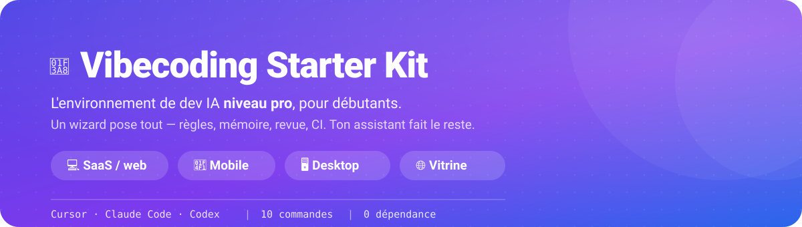
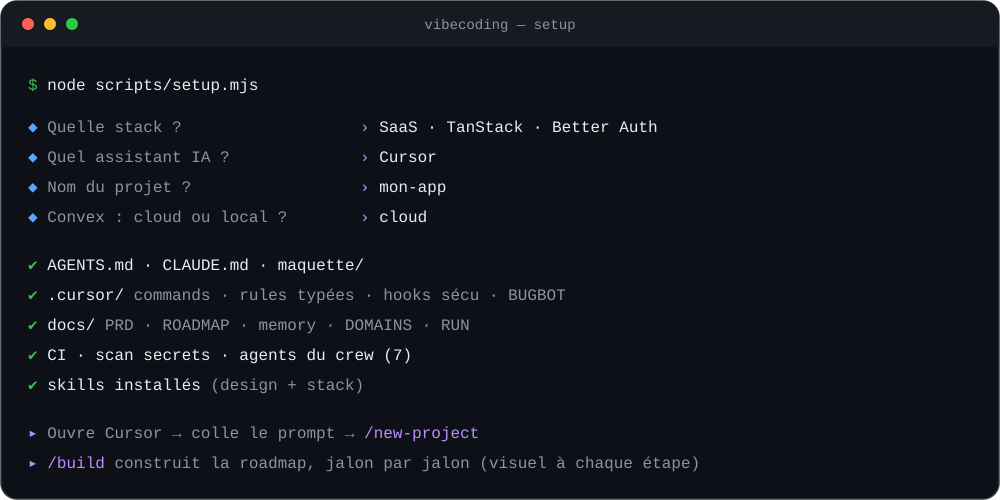
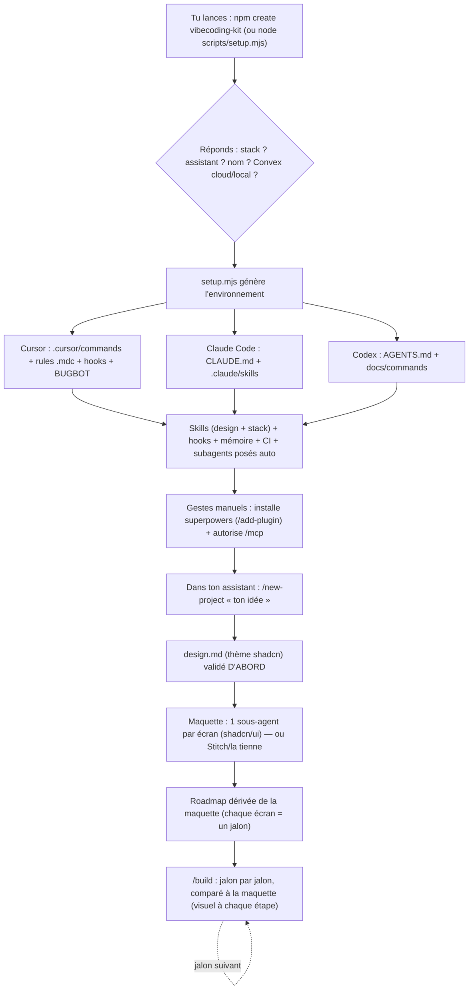

<p align="center">
  
</p>

<p align="center">
  <a href="#-démarrage-rapide"><strong>Démarrage rapide »</strong></a>
  ·
  <a href="#-comment-ça-marche">Comment ça marche</a>
  ·
  <a href="guides/glossaire.md">📖 Glossaire du vibecodeur</a>
  ·
  <a href="https://github.com/ohvignas/vibecoding-starter-kit/issues">Signaler un bug</a>
</p>

<p align="center">
  <a href="https://github.com/ohvignas/vibecoding-starter-kit/actions"></a>
  <a href="https://www.npmjs.com/package/create-vibecoding-kit"></a>
  <a href="LICENSE"></a>
  
  
  <a href="http://makeapullrequest.com"></a>
</p>

---

Ce dépôt fait deux choses : c'est un **kit pour débutants** de la formation **Vibe Coding** (4 stacks expliquées + le contexte à donner à l'IA), **et** un **installeur (wizard interactif)** qui génère un environnement de développement complet — 10 commandes, mémoire persistante, revue de code, **test E2E** (design + fonctionnel), CI, filet de sécurité — pour **Cursor, Claude Code et Codex**.

> [!TIP]
> Pas besoin de choisir un seul assistant : l'installeur configure celui que tu utilises, et le projet reste **portable** (les mêmes règles marchent partout).

<details>
<summary><strong>📑 Table des matières</strong></summary>

- [Pourquoi ce projet](#-pourquoi-ce-projet)
- [Fonctionnalités](#-fonctionnalités)
- [Démarrage rapide](#-démarrage-rapide)
- [Comment ça marche](#-comment-ça-marche)
- [Les commandes](#-les-commandes)
- [Les 4 stacks](#-les-4-stacks)
- [Ce qui est généré](#-ce-qui-est-généré)
- [Mémoire du projet & journal du crew](#-mémoire-du-projet--journal-du-crew)
- [Structure du dépôt](#-structure-du-dépôt)
- [Contribuer](#-contribuer)
- [Licence](#-licence)

</details>

## 💡 Pourquoi ce projet

Le vibecoding — décrire ce qu'on veut à une IA qui code — marche **si l'IA a le bon contexte**. Seule, elle invente des fonctions périmées, oublie les décisions, code des UI hors-charte. Ce kit fournit les **rails** : règles de stack officielles, mémoire qui ne s'oublie pas, boucle de livraison disciplinée, revue de code et de sécurité — tout posé **automatiquement** pour l'assistant de l'élève.

Résultat : un débutant obtient un environnement de dev **niveau pro** sans savoir le configurer.

## ✨ Fonctionnalités

| | Fonctionnalité | Ce que ça fait |
|---|---|---|
| 🚀 | **10 commandes** | `/init-vibecoding`, `/help`, `/new-project`, `/build`, `/new-feature`, `/edit-design`, `/doctor`, `/next`, `/sos`, `/deploy` — tout le cycle de vie |
| 🪜 | **Runbooks en étapes** | les commandes longues ne sont plus un mur de texte : `/new-project` (9 étapes), `/new-feature` (5), `/init-vibecoding` (5) arrivent en **fichiers séparés**, un par étape, avec une **checklist d'entrée** qui dit ce que chacune produit. L'IA en ouvre une à la fois — elle n'en saute plus, et toi tu vois où tu en es |
| 🧩 | **Environnement par stack** | selon la stack, le projet est câblé auto avec les **plugins + MCP + skills + hooks** du framework (`.mcp.json` mergé, checks warn-only, `docs/A-FAIRE.md` joué par l'IA) |
| 💳 | **Catalogue de domaines** | paiement (Stripe/Polar…), email, storage, analytics, erreurs, push, cartes… **choisis d'après le PRD** (`docs/DOMAINS.md`) — pas tout d'un coup |
| 🧠 | **Mémoire auto-croissante** | `docs/memory/` nourri à chaque session, rechargé au démarrage (+ le **prochain jalon roadmap**) → l'IA ne refait pas ses erreurs et sait où elle en est |
| 🛡️ | **Revue + sécu + test** | Les **7 agents du crew** — `verificateur` (le juge : PROUVÉ / NON PROUVÉ / BLOQUÉ) · `code-reviewer` · `security-reviewer` · `test-runner` · `critique-produit` · `critique-donnees` · `critique-ux` — livrés aux **3 assistants**, plus scan de secrets, CI, hook pre-commit |
| 🧪 | **Test complet (design + fonctionnel)** | après **chaque** implémentation : test auto + **navigateur & screenshot** (le rendu) **et** le **parcours E2E** de la feature refait en vrai (Playwright web · **Maestro** mobile · Chrome DevTools desktop), exécuté par un **sous-agent `test-runner` isolé** → économe en tokens |
| 📏 | **Règles permanentes** | injectées dans `AGENTS.md` : **sous-agents** (quand/comment déléguer) · **vérification** · **secrets & coûts** · **CSS-maquette** (pas de slice, vrai CSS, couleur primaire) · design + **accessibilité** |
| 🤖 | **Multi-assistant** | Cursor (règles `.mdc` typées + commandes + hooks sécu + Bugbot), Claude Code (CLAUDE.md + skills), Codex (AGENTS.md) |
| 🎨 | **Design-first → maquette** | on fixe d'abord le **design system** (`design.md`, thème composé en visuel sur [shadcn/ui create](https://ui.shadcn.com/create)) **puis** la maquette (**un sous-agent par écran**, en shadcn/ui) ; **Stitch** ou tes exports marchent aussi. La **roadmap découle de la maquette validée** — le build réalise ce que tu as **dessiné** |
| 🎓 | **Mode apprentissage** | l'IA **enseigne, elle ne t'interroge pas**. À chaque étape franchie elle dit ce qu'elle a fait et **pourquoi ainsi**, puis écrit la leçon dans **`docs/APPRENTISSAGE.md`** : *ce qu'on vient de faire · pourquoi comme ça · le mot du jour, expliqué sur TON projet · un fun fact*. Numéroté, chronologique, jamais écrasé — lu du bout en bout, ce carnet raconte la construction de ton app dans l'ordre où elle s'est faite |
| 📐 | **Planif à fond** | PRD + tech spec + design (tokens via `design.md`, palette via [tweakcn](https://tweakcn.com)) détaillés avant la moindre ligne de code. Le PRD couvre les **12 sections** qu'un vrai cadrage réclame : le **problème** (énoncé sans sa solution), l'**entreprise et ses utilisateurs**, les **objectifs commerciaux** chiffrés et datés, les **parcours utilisateurs**, l'**arborescence** (écrans, navigation, URL) et le **périmètre du MVP** |
| 🔀 | **Deux chantiers de front** | un **worktree par chantier**, la branche **synchronisée avant** de pousser ou de brancher (la cause n°1 des conflits git quand on ouvre deux chats), **un seul serveur de dev** partagé, et tout changement de schéma **annoncé avant**. Le kit pousse sur **la branche où tu es** — il ne présume pas de la façon dont tu organises ton dépôt |
| 🆘 | **Filet de sécurité** | perdu → `/next` ; ça casse → `/sos` (revenir au dernier point vert) ; **Règle Preuve : 3 tentatives** puis `BLOQUÉ`, anti-boucle infernale ; tags git par jalon |
| 🚫 | **Anti-flemme** | **Règle Réalité** : zéro mock, zéro `lorem`, zéro donnée en dur hors des fichiers de test — chaque écran lit et écrit dans le **vrai** backend, chaque bouton marche de bout en bout. Plus zéro placeholder / `// TODO` / stub, zéro report « plus tard ». Non négociable, dans `AGENTS.md` + `.cursor/rules/` |
| 📓 | **Journal du crew** | trois fichiers partagés dans `docs/agents/` : **`JOURNAL.md`** (append-only — une ligne par mission, avec sa preuve), **`state.yaml`** (l'état courant : jalon, tâche, tentatives de réparation, motif de blocage — **un seul écrivain**, le juge), **`inventaire.md`** (le contrat de couverture : tout ce que la maquette et le PRD promettent, ligne par ligne). Chaque agent les lit **avant** de commencer |
| 🪟 | **Fiable & multi-OS** | le wizard fait un `git init` + hooks actifs + commit initial ; rapport honnête (jamais d'écrasement) ; **testé en CI sur Windows/macOS/Linux × Node 20.12/22** |
| 🔄 | **Mise à jour pro** | `npx create-vibecoding-kit --refresh`, depuis ton projet : **régénère** les règles (`AGENTS.md`, entre marqueurs) + runbooks **et leurs étapes** + agents + glossaire + les **docs officielles** de ta stack (`ai-context/`, les `llms.txt` que l'IA lit pour ne pas inventer d'API périmée) — ta zone perso, `src/` et **ce que tu as écrit** dans `docs/` (PRD, design, roadmap, mémoire) **jamais touchés** (`--dry-run` pour prévisualiser) |
| 🔎 | **SEO + GEO** | la stack vitrine sort optimisée Google **et** IA (sitemap, JSON-LD, llms.txt du site, robots IA-friendly) |

## ⚡ Démarrage rapide

**1. Installe le kit** — dans un dossier vide *(publié sur npm ✅)* :

```bash
npm create vibecoding-kit@latest
```

> **Prérequis : Node.js ≥ 20.12 + git.** Le wizard demande stack/assistant/nom (+ Convex cloud/local pour le SaaS, + **mode apprentissage**) et pose **tout** — fichiers, hooks, règles, commandes, mémoire, CI — et **installe les skills** (design + stack). Aucun compte, aucune clé, aucun code : quatre à cinq questions et c'est fini.
>
> **Stack vitrine** : Astro 7 exige **Node ≥ 22.12** (il refuse de démarrer en dessous). Le wizard, lui, tourne dès 20.12.

**2. Ouvre ton assistant IA** dans le dossier du projet et **colle le prompt affiché par le wizard** (aussi sauvé dans `COLLE-MOI-DANS-L-IA.md`)

Ton assistant te guide pour les **gestes manuels** (détaillés dans « [Après l'install](#-après-linstall--ce-quil-te-reste-à-faire) » ci-dessous et dans `docs/A-FAIRE.md`, adapté à ta stack) : installer **superpowers**, le **plugin de ta stack** s'il en existe un, et autoriser les **MCP**. Les skills, eux, sont déjà posés par le wizard. Ensuite, une seule commande à retenir :

```
/help
```

Elle liste les 10 runbooks et dit par où continuer. *(Sur Codex, les runbooks ne sont pas des slash-commandes : ouvre `docs/commands/help.md` et suis-le.)*

> [!TIP]
> La liste exacte des plugins/MCP à cocher est dans **`docs/A-FAIRE.md`**. Tout le reste est déjà posé.

> [!NOTE]
> **Windows** : lance avec `node` (pas de script `.sh`). Les hooks Git tournent sous **Git Bash**. Prérequis : Node.js ≥ 20.12 + git.

<details>
<summary>Préfères-tu tout comprendre à la main ? (chemin débutant)</summary>

Clone le dépôt, lis [`guides/01-comment-parler-a-l-IA.md`](guides/01-comment-parler-a-l-IA.md), puis choisis ta stack dans [`stacks/`](stacks/). Chaque stack a un README débutant + un `AGENTS.md` à copier + des prompts prêts à coller.

Un mot te bloque ? Le **[glossaire du vibe coding](guides/glossaire.md)** explique tout le vocabulaire (LLM, MCP, stack, MVP, hook…) simplement.

</details>

## ✅ Après l'install — ce qu'il te reste à faire

Le wizard a **déjà tout posé dans le projet**. Il reste trois familles de gestes **dans ton assistant IA** (impossible pour un scaffolder d'installer un plugin ou de connecter un compte à ta place) : la boucle superpowers, les plugins, les MCP.

**Combien de cases exactement ? Ça dépend de ton couple stack × assistant** — de **0 à 2 plugins** (certains combos n'en ont aucun) et de **2 à 4 serveurs MCP**. Aucune promesse à l'aveugle ici : ta liste réelle, cochable, est dans **`docs/A-FAIRE.md`**, généré pour *ta* configuration.

**Déjà fait automatiquement — n'y touche pas :** `AGENTS.md`/`CLAUDE.md`, les 10 commandes, les règles, la mémoire, git + hooks (scan de secrets), la CI, `.vibecoding.json`, les **skills** (design + stack) et les **fichiers** de config MCP.

### Geste 1 — installe superpowers (le pilote de la boucle)

| Assistant | Commande |
|---|---|
| Cursor | `/add-plugin superpowers` |
| Claude Code | `/plugin install superpowers@claude-plugins-official` |
| Codex | ouvre `/plugins`, cherche « Superpowers », installe |

Vérifie : tape `/brainstorm`. Si la commande est reconnue, c'est bon.

### Geste 2 — installe le plugin de ta stack *(seulement si ton combo en a un)*

C'est le plugin propre à la techno de ta stack. Certaines combinaisons stack × assistant n'en ont **pas** (rien à faire alors) — c'est le cas de la stack **Vitrine**, qui n'a aucun plugin dédié.

| Ta stack | Plugin | Disponible pour |
|---|---|---|
| **SaaS** | Convex | Cursor, Claude Code |
| **Mobile** | Expo (+ Convex) | Claude Code, Codex |
| **Desktop** | Electron | Claude Code |

La **commande exacte** est dans `docs/A-FAIRE.md` § 1 (elle dépend de ton assistant). Exemple pour **Cursor + SaaS** :

```bash
git clone https://github.com/get-convex/convex-agent-plugins ~/.cursor/plugins/convex-agent-plugins
```

### Geste 3 — autorise les MCP

Tape `/mcp` (ou, sur Cursor, **Settings → MCP**). Les serveurs à activer selon ta stack :

| Ta stack | Serveurs MCP |
|---|---|
| **SaaS** | Convex · Better Auth · shadcn · **Playwright** *(test E2E)* |
| **Mobile** | Convex · Expo *(login requis)* · **Maestro** *(test E2E — installe le CLI d'abord, voir A-FAIRE)* |
| **Desktop** | Chrome DevTools *(test E2E)* · shadcn |
| **Vitrine** | Astro Docs · shadcn · **Playwright** *(test E2E)* |

### Optionnel — design par IA (Stitch)

Si tu n'as **pas** de maquette à fournir : crée une clé API sur [stitch.withgoogle.com](https://stitch.withgoogle.com) (Settings → Create API Key), puis branche le MCP Stitch **au niveau utilisateur** (pas dans le dépôt → la clé n'est jamais commitée). Étapes exactes dans `docs/A-FAIRE.md` § 5.

### Puis tu codes

```
/help
```

`/help` t'oriente ; pour démarrer un projet il t'enverra sur `/new-project « ton idée »`.

| Commande | Ce qu'elle fait |
|---|---|
| `/new-project` | **9 étapes** : problème + entreprise → PRD + tech spec → arborescence → **maquette** → roadmap dérivée |
| `/build` | construit **jalon par jalon**, comparé à la maquette (visuel à chaque étape) |
| `/doctor` | vérifie que plugins / MCP / skills sont bien branchés |
| `/next` · `/sos` · `/deploy` | quoi faire ensuite · débloquer · mettre en ligne |

Bloqué ? Lance **`/doctor`** : il te dit précisément ce qui manque.

## 🔍 Comment ça marche

<p align="center">
  
</p>


```mermaid
flowchart TD
    A["Tu lances : npm create vibecoding-kit (ou node scripts/setup.mjs)"] --> C{"Réponds : stack ? assistant ? nom ? Convex cloud/local ?"}
    C --> D["setup.mjs génère l'environnement"]
    D --> E1["Cursor : .cursor/commands + rules .mdc + hooks + BUGBOT"]
    D --> E2["Claude Code : CLAUDE.md + .claude/skills"]
    D --> E3["Codex : AGENTS.md + docs/commands"]
    E1 --> F["Skills (design + stack) + hooks + mémoire + CI + subagents posés auto"]
    E2 --> F
    E3 --> F
    F --> G0["Gestes manuels : installe superpowers (/add-plugin) + autorise /mcp"]
    G0 --> G["Dans ton assistant : /new-project « ton idée »"]
    G --> DZ["design.md (thème shadcn) validé D'ABORD"]
    DZ --> M["Maquette : 1 sous-agent par écran (shadcn/ui) — ou Stitch/la tienne"]
    M --> R["Roadmap dérivée de la maquette (chaque écran = un jalon)"]
    R --> H["/build : jalon par jalon, comparé à la maquette (visuel à chaque étape)"]
    H -.->|jalon suivant| H
```

Le **pilote** est la boucle [superpowers](https://github.com/obra/superpowers) : `brainstorm → plan → exécution (sub-agents, TDD) → review → test live → sécu → commit → PR → CI → merge`. Elle est écrite dans l'`AGENTS.md`/`CLAUDE.md` généré, toujours en contexte.

## 🎛️ Les commandes

| Commande | Rôle |
|---|---|
| **`/help`** | **L'entrée — la seule à retenir.** Les 10 commandes expliquées en français simple, et « par où continuer » selon ce que l'IA voit dans ton projet |
| **`/init-vibecoding`** | Le tout-en-un : l'IA **installe l'environnement pour toi** (ou met à jour un projet existant) et te déroule `docs/A-FAIRE.md` pas à pas. À lancer quand rien n'est encore posé |
| **`/new-project`** | La fondation, en **9 étapes** que l'IA ouvre une par une : cadrage (le **problème**, l'**entreprise**, les **objectifs commerciaux**) → **PRD** → **tech spec** → **arborescence** (écrans, navigation, URL) → **design system** (`design.md`, thème shadcn) **puis maquette** (un **sous-agent par écran** en shadcn/ui, ou **Stitch**/la tienne) → **roadmap dérivée de la maquette** (chaque jalon = un écran qui devient réel) → scaffold |
| **`/build`** | Construit la roadmap **jalon par jalon** (subagent-driven, TDD) en **relançant la vraie app à chaque étape** et en la **comparant à la maquette** — tu vois ton produit grandir. Gate « on continue ? » à chaque jalon (`--all` reste désactivé en mode apprentissage). Chaque jalon franchi ajoute sa **leçon** à `docs/APPRENTISSAGE.md` — ce qu'on a fait, **pourquoi comme ça**, et le mot du jour |
| **`/new-feature`** | La livraison d'une feature isolée : **story + critères d'acceptation** → build TDD → **test live** → sécu → commit → PR → CI → merge sur `main` |
| **`/edit-design`** | Charge les **4 skills design** + `design.md` **avant** de toucher l'UI (+ blocs pré-faits `@shadcnblocks` au besoin) |
| **`/doctor`** | Auto-diagnostic : fichiers présents, **MCP de la stack** OK, hooks câblés, **aucun secret commité**, `.gitignore` correct |
| **`/next`** | « Je fais quoi maintenant ? » — l'IA lit l'état du projet et te donne ta **prochaine action** |
| **`/sos`** | Quelque chose casse : diagnostic **rassurant** + 3 sorties (réparer / mettre de côté / revenir au dernier point vert) |
| **`/deploy`** | Mettre l'app **en ligne** selon la stack (Convex + Vercel/Netlify · Expo EAS · Electron Forge `npm run make` · Astro statique) — gate CI verte + revue sécu, secrets prod jamais commités |

Chaque commande est livrée au bon format : **commandes Cursor** (`.cursor/commands/`, typables au clavier), **commandes Claude Code** (`.claude/commands/`), ou référencée dans `AGENTS.md` (Codex).

Les trois commandes longues arrivent en plus avec un **dossier d'étapes à côté d'elles** (`new-project/`, `new-feature/`, `init-vibecoding/`) — **19 fichiers** au total, un par étape. Chez **Codex**, où les runbooks ne sont pas des slash-commandes, le fichier que tu ouvres **contient déjà toutes ses étapes dans l'ordre** : un seul fichier à lire.

> [!TIP]
> **Après l'install** : `/doctor` doit dire « ✅ ton environnement est prêt ». Ensuite, `/help` t'oriente. **Maîtrise tes coûts IA** → [`docs/COUTS.md`](docs/COUTS.md).

> [!TIP]
> **Récupérer les nouveautés du kit dans un vieux projet** — depuis le dossier du projet, **rien à cloner** :
> - `npx create-vibecoding-kit --refresh` — **régénère** ce qui est 100 % kit et que tu n'édites pas : les règles (`AGENTS.md`, entre les marqueurs), les 10 runbooks **et leurs 19 étapes**, les 7 agents du crew, `docs/glossaire.md`, `docs/templates/` et les docs officielles d'`ai-context/`. **Ce que tu as écrit n'est jamais touché** : ta zone « Tes règles à toi », `src/`, et tes propres docs — `docs/PRD.md`, `docs/design.md`, `docs/ROADMAP.md`, `docs/memory/`, `docs/A-FAIRE.md`, **`docs/APPRENTISSAGE.md`** (tes leçons t'appartiennent : un refresh qui les écraserait détruirait exactement ce qu'on te promet de garder), et la mémoire du crew (`docs/agents/JOURNAL.md`, `state.yaml`, `inventaire.md`). Seule exception, voulue : sur Codex les 7 agents vivent dans `docs/agents/crew/` — ceux-là sont du kit, donc régénérés. Ajoute `--dry-run` pour prévisualiser.
> - Si tu as le dépôt en local : `node <kit>/scripts/update.mjs` **ajoute** les fichiers neufs sans rien écraser, et `--refresh` fait la même régénération que ci-dessus.

> [!TIP]
> **Déjà un projet Cursor et tu veux juste les commandes ?** Installe le **plugin Cursor** `vibecoding` (`/add-plugin`, via une Team Marketplace ou la marketplace Cursor) — tu obtiens les 10 commandes + la règle de base sans rien scaffolder. Le plugin est dans [`cursor-plugin/`](cursor-plugin/) (voir [`PUBLISH.md`](PUBLISH.md)). Pour un **nouveau** projet complet, préfère `npm create vibecoding-kit`.

## 🧱 Les 4 stacks

| Type d'app | Stack |
|---|---|
| 💻 **SaaS / web** | Convex + TanStack Start + Better Auth |
| 📱 **Mobile iOS/Android** | React Native (Expo) + Convex |
| 🖥️ **Desktop** | Electron |
| 🌐 **Vitrine** | Astro + shadcn/ui + Keystatic — site vitrine, portfolio, blog, SEO + GEO (cité par les IA) |

Chaque stack : explication débutant, **docs officielles vérifiées**, `AGENTS.md`, `llms.txt` téléchargeables (`ai-context/`), et un **exemple de feature** (`docs/examples/`).

## 📦 Ce qui est généré

<details>
<summary>Voir l'arbre d'un projet généré (assistant Claude Code)</summary>

```text
mon-app/
├── AGENTS.md · CLAUDE.md          # règles + boucle + @import mémoire (toujours les deux)
├── .claude/
│   ├── commands/                  # /new-project /build /new-feature /edit-design /doctor
│   │   └── new-project/           # ses 9 étapes, une par fichier (idem new-feature/, init-vibecoding/)
│   ├── settings.json              # hooks PostToolUse (checks) + SessionStart (mémoire) + PreToolUse (garde-shell)
│   ├── hooks/                     # inject-memory + guard-shell (format Claude Code)
│   ├── skills/stack-*             # règles de la stack
│   └── agents/                    # les 7 agents du crew : verificateur, code-reviewer, security-reviewer,
│                                  #   test-runner, critique-produit, critique-donnees, critique-ux
│                                  #   (Cursor : .cursor/agents/ · Codex : docs/agents/crew/)
├── docs/
│   ├── A-FAIRE.md                # plugins/skills/MCP à installer (joué par l'IA)
│   ├── DOMAINS.md                 # catalogue des capacités métier de la stack
│   ├── ROADMAP.md                 # jalons (✅ ce que tu vois) — piloté par /build
│   ├── RUN.md                     # comment lancer l'app + ce que tu dois voir
│   ├── APPRENTISSAGE.md           # ton carnet : une leçon par étape, dans l'ordre (jamais écrasé)
│   ├── memory/                    # index + gotchas/conventions/decisions/archive
│   └── examples/                  # une feature d'exemple, prête à copier
├── .github/workflows/             # ci · secrets (gitleaks)
├── .githooks/                     # pre-commit (secrets+lint) · pre-push (sécu) · checks.mjs
├── ai-context/                    # llms.txt officiels
├── .env.example · .gitignore · .mcp.json   # MCP mergé par stack
└── maquette/
```
_(Cursor à la place : `.cursor/commands/` (mêmes slash-commands) · `.cursor/rules/*.mdc` typées (auto-attachées par framework) · `.cursor/hooks.json` + `.cursor/hooks/` (mémoire + `guard-shell` sécu) · `.cursor/BUGBOT.md` (review PR) · `.cursor/environment.json` (dev reproductible) · `.cursorignore` + `.cursorindexingignore`.)_

</details>

## 🧠 Mémoire du projet & journal du crew

- **Mémoire** — un « cerveau du projet » dans `docs/memory/` : dès que l'IA découvre un piège, elle l'écrit ; au démarrage, un **hook** le réinjecte.
- **Consolidation** — quand l'index grossit, tu demandes à l'IA de **consolider** (dédoublonner, archiver). Ça se passe **dans le fil**, tu vois le diff.
- **Journal** — `docs/agents/JOURNAL.md` est **append-only** : une ligne par mission (`date · agent · mission · statut · preuve · décision`), jamais effacée. C'est la mémoire partagée des agents entre deux conversations.
- **État** — `docs/agents/state.yaml` dit **où en est le projet** (`status`, jalon et tâche en cours, `repair_attempts`, `blocked_reason`, dernière preuve). Tout le monde le lit, **un seul agent l'écrit** — sinon l'état ne veut plus rien dire.
- **Couverture** — `docs/agents/inventaire.md` liste **élément par élément** (un bouton, un champ, une modale) ce que la maquette et le PRD promettent, avec le jalon qui le rend fonctionnel. Ce qui n'y est pas ne sera pas construit.

### Les deux règles qui gouvernent tout

- **Règle Preuve** — on ne déclare pas, on **prouve**. Trois statuts et rien d'autre : `PROUVÉ` (commande écrite + **sortie brute collée** + code 0) · `NON PROUVÉ` · `BLOQUÉ`. « Ça marche » sans preuve est interdit. Un agent ne prononce jamais `PROUVÉ` sur du code qu'il a écrit lui-même, et **3 tentatives** sur le même bug suffisent : à la 3ᵉ, `BLOQUÉ`, le piège part dans `docs/memory/gotchas.md`. Fini la boucle infernale.
- **Règle Réalité** — mieux vaut **lent et réel** que rapide et bidon : vraies données du vrai backend, chaque bouton câblé de bout en bout, la maquette reproduite à l'identique. Les mocks n'ont droit de cité que dans les fichiers de test.

> [!IMPORTANT]
> Aucune tâche planifiée, aucune clé API en arrière-plan : rien ne tourne sans que tu l'aies lancé.

## 🗂️ Structure du dépôt

```text
vibecoding-starter-kit/
├── guides/            # comment parler à l'IA · installer les outils · sécurité & coûts
├── stacks/            # saas · mobile · desktop · vitrine (README + AGENTS.md + prompts)
├── ai-context/        # llms.txt + règles officielles (via scripts/download-ai-context.sh)
├── playbook/          # le runbook que l'IA suit pour installer
├── templates/         # commandes, agents, mémoire, CI, env, exemples
├── scripts/           # setup.mjs (moteur) + lib/ (testé, node --test)
└── docs/superpowers/  # specs & plans (design du système)
```

## 🤝 Contribuer

Les tests tournent sans dépendance :

```bash
git clone https://github.com/ohvignas/vibecoding-starter-kit.git
cd vibecoding-starter-kit
node --test        # toute la suite
```

Les specs/plans du système sont dans [`docs/superpowers/`](docs/superpowers/). PRs bienvenues.

## 📄 Licence

Distribué sous licence **MIT** — voir [`LICENSE`](LICENSE).

> Structures de templates (PRD, architecture, story) adaptées de [BMAD-METHOD](https://github.com/bmad-code-org/BMAD-METHOD) (MIT). `DESIGN.md` d'après [google-labs-code/design.md](https://github.com/google-labs-code/design.md) (Apache-2.0). Boucle de dev : [superpowers](https://github.com/obra/superpowers).

---

<p align="center">
  Fait avec ❤️ pour la formation <strong>Vibe Coding</strong> · par <a href="https://github.com/ohvignas">@ohvignas</a>
</p>
